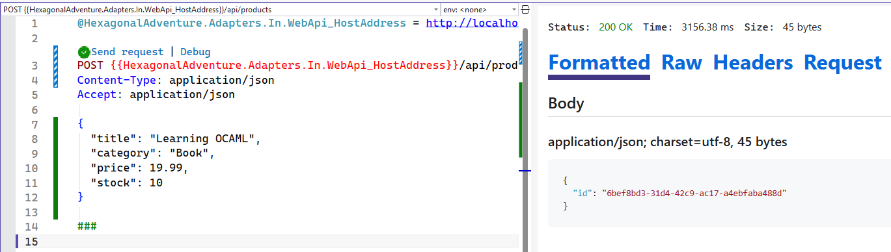

# Hexagonal Architecture 101

Hexagonal yazılım mimarisinin prensiplerini basit senaryolar üzerinden uygulamalı olarak öğrenmeye çalıştığım proje ve kodlarının yer aldığı repodur.

Bu mimari bazı kaynaklarda "Ports and Adapters" olarak da geçiyor. Orijini [Alistair Cockburn'ın şuradaki](https://alistair.cockburn.us/hexagonal-architecture) yazısına dayanıyor. Kaynaklara göre **2005** yılında beri hayatımızda olan bir tasarım. Tabii işin temelinde çok temel yazılım kavramları ve ilkeleri var. Her şey uygulama domain'i içerisindeki iş kurallarının dış dünyadan tamamen izole edilebilmesi fikrine dayanıyor. Bu zaten bir çok modern mimari yaklaşımın ana noktalarından birisi ancak uygulama biçimleri farklılık gösterebiliyor.

Sonuçta gevşek bağlılık *(Loose Coupling)*, sorumlulukların doğru ayrılması *(Separation of Concerns)*, bağımlılıkların tersine çevrilmesi *(Inversion of Control)*, bağımlılıkların dışarıdan sağlanması *(Dependency Injection)*, zengin nesneler *(rich entity - yazılım prensibi diyemesek de DDD'nin izlerinden birisi olarak mimaride yer bulabilir)* kullanılması gibi temel prensipler üzerine kurulu bir mimari. Bu prensipler sayesinde uygulama domain'i içerisindeki iş kuralları, dış dünyadan gelen veri kaynaklarından, kullanıcı arayüzünden, diğer sistemlerle entegrasyonlardan tamamen izole edilebilmektedir. Böylece uygulama domain'i içerisindeki kodun test edilebilirliği, sürdürülebilirliği ve esnekliği de artmakta.

Internette genellikle aşağıdakine benzer bir görsel ile bu mimari 50bin feet yüksekten anlatılmaya çalışır. *(Excalidraw.io üzerinde insan eliyle çizilmiştir :P)*


Grafiği şöyle özetlemeye çalışalım. İş kuralları ve domain yapısı tamamen Application katmanında yer alır. Bunu adaptörlerin oluşturduğu bir başka katman sarar. Adaptörler, uygulama domain'ini dış dünyaya bağlayan bir köprü görevi görürler. Dış dünya ise kullanıcı arayüzü, veri tabanı, diğer sistemlerle entegrasyonlar gibi unsurları içerir. Adaptörler, portlara bağlanarak uygulama domain'ine erişim sağlarlar. Portlar ise uygulama domain'inin dış dünyaya açılan kapılarıdır. Bu sayede uygulama domain'i tamamen izole edilmiş olur ve dış dünyadan gelen değişikliklerden etkilenmez. Böyle anlatınca ne güzel değil mi? Soyut soyut :D Pek tabii uygulamayı yazıp, avantaj ve dezavantajlarını görmeden mimariyi anlamamız pek mümkün değil.

**Mimarinin ana sloganı şudur:** Seperating Business Logic from Infrastructure with Ports and Adapters. Yani iş kurallarını altyapıdan portlar ve adaptörler ile ayırmak.

Burada kafa karıştıcı bazı meseleler olabiliyor. Örneğin adaptörlerin Inbound ve Outbound olarak ikiye ayrılması, portların ne olduğu, adaptörlerin portlara nasıl bağlandığı vb. Ben bu konuları mümkün olduğunca basit senaryolar üzerinden uygulamalı olarak incelemek istiyorum. Bu repodaki temel amacım bu...

## Senaryo

Kısır bir senaryo ile başlayalım. Stok takibi yapmak istediğimiz ürünler var. Buradaki basit iş kurallarını hexagonal mimarisine göre ele almaya çalışacağız. Uygulama kodlarını .Net platformunda C# ile yazacağım. Elbette bu mimariyi uygulamaya uygun farklı bir platform veya dilde seçilebilir. Sonuçta mimarinin prensipleri değişmeyecektir.

## Geliştirme Aşamaları

### 1. Solution ve Proje Yapısının İnşa Edilmesi

Solution yapısını aşağıdaki gibi oluşturabiliriz.


- **HexagonalAdventure.Domain** bir class library ve domain nesneleri ile iş kurallarını içeriyor.
- **HexagonalAdventure.Application** yine bir class library ve In/Out port nesnelerini içeriyor. Inbound Port'lar dış dünyanın çekirdeğe ulaşmak için kullanacağı sözleşmeler olarak düşünülebilir. Outbound Port nesneler ise çekirdeğin dış dünyadan yaptırmak istediği işler için kullanılan sözleşmedir.
- **HexagonalAdventure.Adapters** ise şu anda iki proje içeriyor. Bunlardan birisi Class Library ve Outbound Adapter olarak düşünülebilir. Örneğin EF tabanlı bir Repository implementasyonu burada yer alır. Outbound Port'ta tanımlanan sözleşmenin somut olarak uygulandığı yerdir. Diğer proje ise bir Web Api'dir ve Inbound Adapter olarak düşünülebilir. Dış dünyandan gelen isteği alır ve Inbound Port üstünden sistemi tetikler. Hatta web api projesindeki program sınıfı *Composition Root* görevini üstlenir. Yani uygulama başlarken port ve adaptörlerin eşleştirilip birbirine bağlandığı yerdir. Bu sayede uygulama domain içerisindeki kodun dış dünyaya olan bağımlılığı tamamen ortadan kalkar.

### 2. Domain Modelinin Oluşturulması

Şimdi **domain** katmanına gelip *rich entity* modunda bir **Product** sınıfı oluşturalım. Bu sınıf ürünün temel özelliklerini ve iş kurallarını içerecek şekilde aşağıdaki gibi tasarlanabilir.

```csharp
namespace HexagonalAdventure.Domain;

public class Product
{
    public Guid Id { get; private set; }
    public string Title { get; private set; }
    public decimal ListPrice { get; private set; }
    public string Category { get; private set; } // Category ayrı bir entity olabilir, şimdilik string olarak bıraktım
    public int StockQuantity { get; private set; } // Sonrasında Value Object olarak refactor edilebilir

    public Product(Guid id, string title, decimal listPrice, string category, int initialStock)
    {
        Id = id;
        Title = string.IsNullOrWhiteSpace(title) ? throw new ArgumentException("Title cannot be empty") : title;
        ListPrice = listPrice > 0.0M ? listPrice : throw new ArgumentException("List price must be greater than 0.0");
        Category = string.IsNullOrWhiteSpace(category) ? throw new ArgumentException("Category cannot be empty") : category;
        StockQuantity = initialStock >= 0 ? initialStock : throw new ArgumentException("Initial stock cannot be negative");
    }

    public void IncreaseStock(int quantity)
    {
        if (quantity <= 0) throw new ArgumentException("Quantity to increase must be greater than 0");

        StockQuantity += quantity;
    }

    public void DecreaseStock(int quantity)
    {
        if (quantity <= 0) throw new ArgumentException("Quantity to decrease must be greater than 0");
        if (StockQuantity - quantity < 0) throw new InvalidOperationException("Insufficient stock to decrease by the specified quantity");

        StockQuantity -= quantity;
    }
}
```

Şimdilik birçok detayı atladık. Sadece ürün stok bilgisinin temel iş kurallarını ele alacağımı bir senaryo ile ilerleyeceğiz.

### 3. Portların Tanımlanması

Çok doğal olarak ve büyük bir ihtimalle ürünler veritabanında tutulacaktır. Core'da yer alan domain katmanının veritabanı teknolojilerinden bihaber olması gerekir. İletişimi sadece bir sözleşme üzerinden yapmalıdır, yani bir **Interface** *(veya mimarideki adıyla port)* Bu amaca hizmet eden enstrüman **Outbound Port** olarak isimlendiriliyor. Solution yapımızı düşünecek olursak bizim için gerekli sözleşme tipini **HexagonalAdventure.Application** projesinde **Ports/Outbond** klasöründe aşağıdaki gibi tanımlayabiliriz.

```csharp
using HexagonalAdventure.Domain;

namespace HexagonalAdventure.Application.Ports.Outbound;

public interface IProductRepository
{
    void AddProduct(Product product);
    Product GetById(Guid id);
}
```

Senaryomuz gereği sadece iki fonksiyonellik tanımladık. Birisi ürün eklemek, diğeri ise ürünü Id bilgisine göre çekmek için. Burada bir **interface** tanımı söz konusu ve dikkat edileceği üzere ne tür bir kütüphane ile, hangi veritabanına nasıl erişileceğine dair hiçbir detay da yer almıyor. Domain katmanı bu sözleşmeyi aslında aşağıdaki gibi kullanıyor;

- Lütfen bana şu Id'ye sahip ürünü getir.
- Lütfen bilgilerini verdiğim ürünü ekle.

### 4. Uygulama Servisi ve Use Case'in Tanımlanması

Merkez domain nesnesinde temel iş kurallarımız ve dışarıya açılan bir sözleşmemiz hazır. Şimdi bu iki enstrümanı kullanarak asıl iş akışını yönetecek olan uygulama servisini *(Application Service)* yazmamız gerekiyor. Bu servis sınıfı dışarıdan gelen isteği alaccak ve ilgili domain nesnesini oluşturup güncelleyecek. Burada bir port'da kullanması gerekecek. Tipik olarak bir orkestrasyon yapacak diyebiliriz. Bu servis sınıfını **HexagonalAdventure.Application** projesindeki **Services** klasöründe aşağıdaki gibi yazabiliriz.

```csharp
using HexagonalAdventure.Application.Ports.Outbound;
using HexagonalAdventure.Domain;

namespace HexagonalAdventure.Application.Services;

public class ProductService(IProductRepository productRepository)
{
    private readonly IProductRepository _productRepository = productRepository;

    public Guid CreateProduct(string title, decimal price, string category, int stock)
    {
        // Domain nesnesi oluşturulur ve orada tanımlı iş kuralları da yürütülür.
        var product = new Product(Guid.NewGuid(), title, price, category, stock);
        // Outbound port olarak tanımladığımız arayüz üzerinden ürün ekleme işlevi çağırılır
        _productRepository.AddProduct(product);
        return product.Id;
    }
}
```

Böylece uygulamanın dışarıya veri gönderen kısmını da yazmış olduk. Şimdilik stok artırma ve azaltma işlemlerini eklemedik. Önce genel hatları ile inşa etmeye çalışalım. Daha yapılacak çok iş var.

### 5. Inbound Adaptörün Yazılması ve Entegrasyonu

Az önce bir uygulama servisi yazdık. Bunun dış sistemler tarafından nasıl kullanılacağına bir bakalım. Bunun için Web Api projesini kobay olarak ele alacağız. Dikkat etmemiz gereken şey API projesindeki **Controller** nesnesinin *(ki adaptör görevini üstlenecek)* **ProductService**'e doğrudan bağımlı olMAmasını sağlamak. Veritabanı tarafında nasıl bir **outbound port** tanımladıysak burada da dış dünyanın çekirdek ile konuşması için bu sefer ters yönlü bir **inbound port** enstrümanı hazırlayacağız. Tabii eksik olan birkaç şey daha var. Örneğin somut repository sınıfını yazmalıyız ve pek tabii program sınıfında gerekli **dependency injection** tanımlamalarını da yapmalıyız. Ancak öncelikle inbound port tanımını yaparak başlayalım.

Bu yüzden ilk olarak **HexagonalAdventure.Application** projesindeki **Ports/Inbound** klasörüne aşağıdaki kod içeriğine sahip sözleşme tipini eklememiz gerekiyor.

```csharp
namespace HexagonalAdventure.Application.Ports.Inbound;

public interface IProductService
{
    Guid CreateProduct(string title, decimal price, string category, int stock);
}
```

Controller'ın, ProductService'e doğrudan bağımlı olMamasını bu sözleşmeyi **ProductService** sınıfına implemente ederek sağlayabiliriz. Dolayısıyla bir önceki adımda tanımladığımız **ProductService** sınıfını aşağıdaki gibi güncelleyerek ilereyelim.

```csharp
public class ProductService(IProductRepository productRepository)
    : IProductService
{
    // DİĞER KODLAR
}
```

Şimdi de asıl adaptör görevini üstlenen **controller** sınıfını ekleyelim. Bu sınıfı da aşağıdaki gibi geliştirebiliriz.

```csharp
using HexagonalAdventure.Application.Ports.Inbound;
using Microsoft.AspNetCore.Mvc;

namespace HexagonalAdventure.Adapters.In.WebApi.Controllers;

[ApiController]
[Route("api/[controller]")]
public class ProductsController(IProductService productService)
    : Controller
{
    private readonly IProductService _productService = productService;

    [HttpPost]
    public IActionResult Create([FromBody] CreateProductRequest request)
    {
        var productId = _productService.CreateProduct(request.Title, request.Price, request.Category, request.Stock);
        return Ok(new { Id = productId });
    }
}

public record CreateProductRequest(string Title, decimal Price, string Category, int Stock);
```

Burada dikkat etmemiz gereken nokta adaptör görevini üstlenen controller sınıfının ProductService'i bir arayüz üzerinden kullanmasıdır. Böylece controller sınıfı ProductService'in somut implementasyonundan bağımsız hale gelmiş olur. Tabii bir şeye daha ihtiyacımız olacak. O da somut repository sınıfı. İlk senaryoda verileri bellekte bir **dictionary** koleksiyonu olarak tutabiliriz. Bu amaçla **HexagonalAdventure.Adapters.Out.InMemory** isimli sınıf kütüphanesini kullanabiliriz. Burada **outbound adapter** görevini üstlenecek olan **InMemoryProductRepository** isimli bir sınıf pekala işimiz görür.

```csharp
using HexagonalAdventure.Application.Ports.Outbound;
using HexagonalAdventure.Domain;

namespace HexagonalAdventure.Adapters.Out.InMemory;

public class InMemoryProdutRepository
    : IProductRepository
{
    private readonly Dictionary<Guid, Product> _products = [];
    public void AddProduct(Product product)
    {
        _products.Add(product.Id, product);
    }

    public Product GetById(Guid id)
    {
        _products.TryGetValue(id, out var product);
        return product;
    }
}
```

Artık Web Api tarafındaki son aşamayı tamamlayabiliriz. Program.cs sınıfını aşağıdaki gibi kodlayarak ilerleyelim.

```csharp
using HexagonalAdventure.Adapters.Out.InMemory;
using HexagonalAdventure.Application.Ports.Inbound;
using HexagonalAdventure.Application.Ports.Outbound;
using HexagonalAdventure.Application.Services;

var builder = WebApplication.CreateBuilder(args);
builder.Services.AddControllers();

// Dependency Injection tanımlamaları
builder.Services.AddSingleton<IProductRepository, InMemoryProdutRepository>(); // Tüm uygulama boyunca tek bir instance kullanılır
builder.Services.AddScoped<IProductService, ProductService>();

builder.Services.AddOpenApi();

var app = builder.Build();

if (app.Environment.IsDevelopment())
{
    app.MapOpenApi();
}

app.UseHttpsRedirection();
app.UseAuthorization();
app.MapControllers();

await app.RunAsync();
```

Şu haliyle Web api projesini ayağa kaldırıp aşağıdaki örnek http talebi ile deneyebiliriz.

```http
@HexagonalAdventure.Adapters.In.WebApi_HostAddress = http://localhost:5144

POST {{HexagonalAdventure.Adapters.In.WebApi_HostAddress}}/api/products
Content-Type: application/json
Accept: application/json

{  
  "title": "Learning OCAML",
  "category": "Book",
  "price": 19.99,
  "stock": 10
}
```

En azından aşağıdaki ekran görüntüsünde olduğu gibi bir yanıt almamız gerekiyor.



## Yeni Deneyimler

Kaba taslak mimariyi uyguladık gibi görünüyor. Şimdi mimarimizin merkezine hiç dokunmadan bir değişiklik yapmaya çalışalım. Örneğin veritabanı tarafında **Postgresql** kullanan bir **Outbound Adapter** eklemeye çalışalım.

DEVAM EDECEK...
