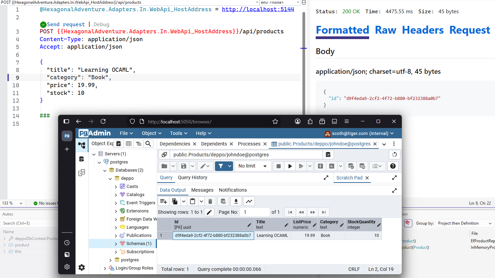
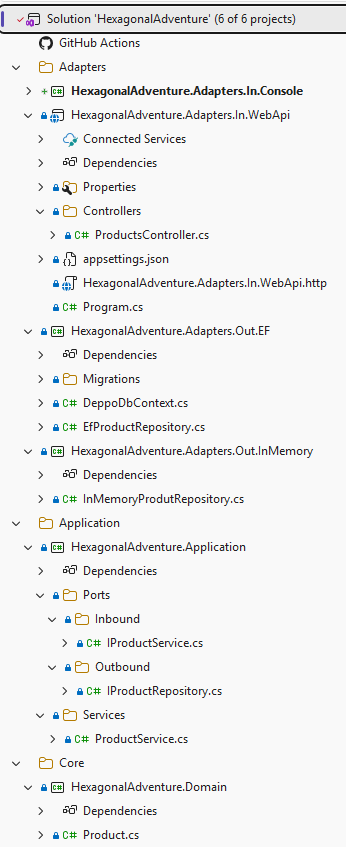
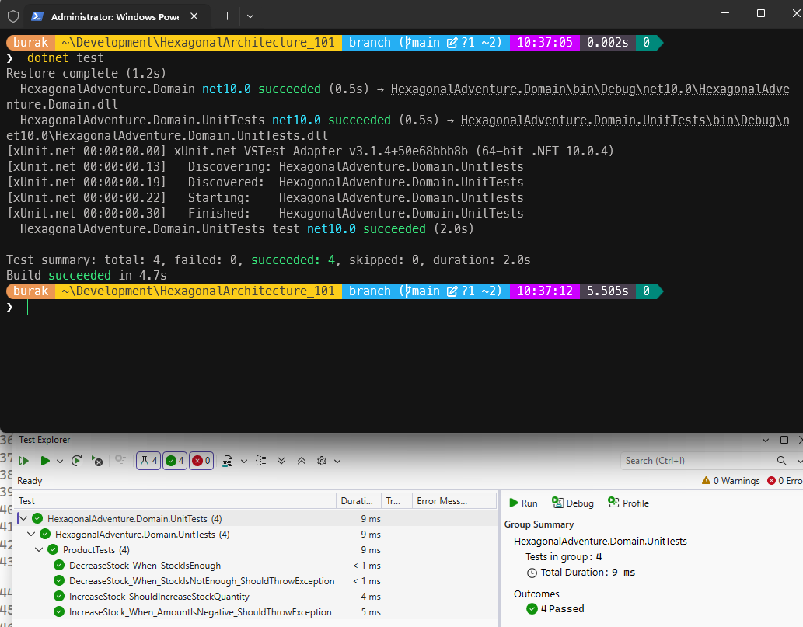
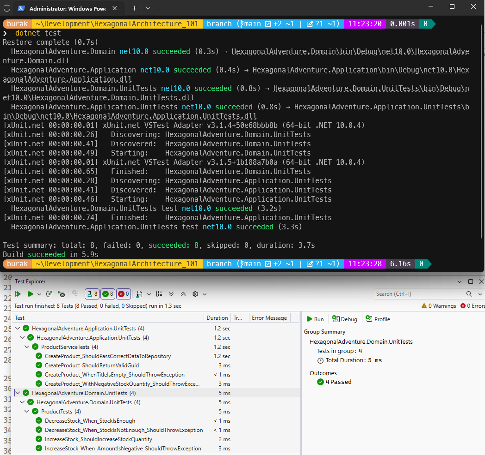
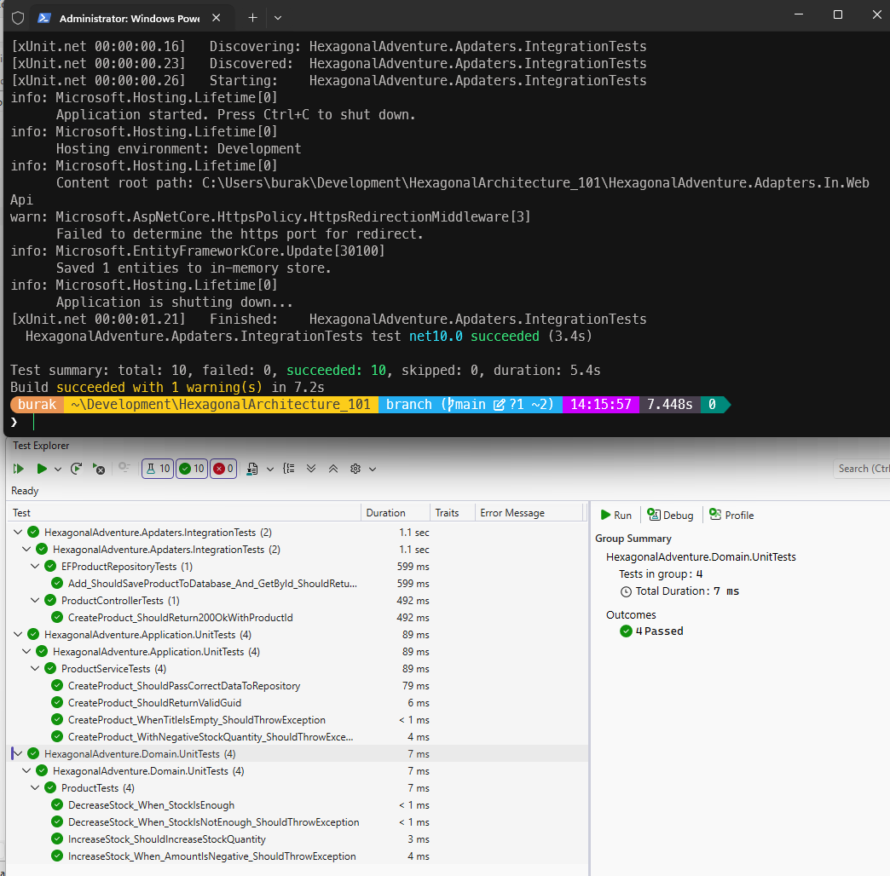
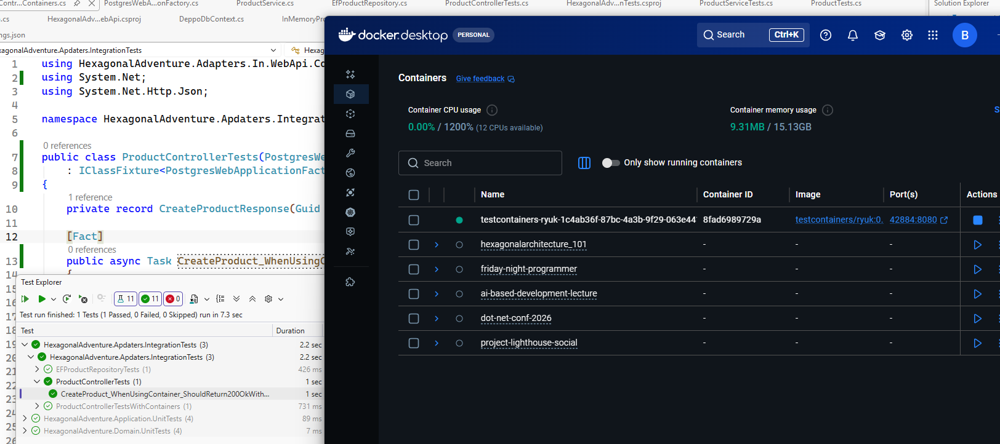
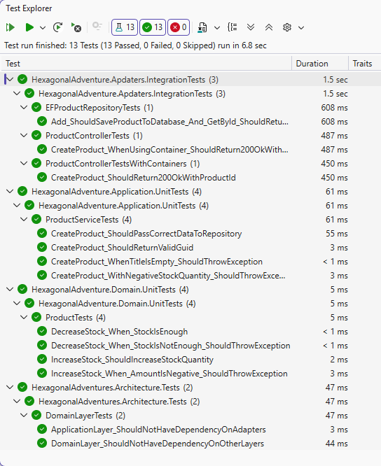
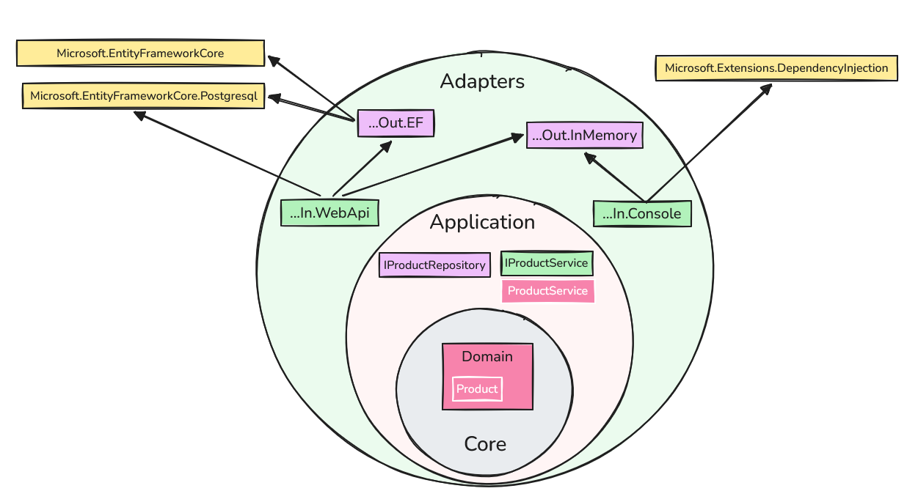

# Hexagonal Architecture 101

Hexagonal yazılım mimarisinin prensiplerini basit senaryolar üzerinden uygulamalı olarak öğrenmeye çalıştığım proje ve kodlarının yer aldığı repodur.

- [İçerik](#hexagonal-architecture-101)
  - [Mimari Hakkında Genel Bilgiler](#mimari-hakkında-genel-bilgiler)
  - [Senaryo](#senaryo)
  - [Geliştirme Aşamaları](#geliştirme-aşamaları)
    - [1. Solution ve Proje Yapısının İnşa Edilmesi](#1-solution-ve-proje-yapısının-inşa-edilmesi)
    - [2. Domain Modelinin Oluşturulması](#2-domain-modelinin-oluşturulması)
    - [3. Portların Tanımlanması](#3-portların-tanımlanması)
    - [4. Uygulama Servisi ve Use Case'in Tanımlanması](#4-uygulama-servisi-ve-use-casein-tanımlanması)
    - [5. Inbound Adaptörün Yazılması ve Entegrasyonu](#5-inbound-adaptörün-yazılması-ve-entegrasyonu)
  - [Yeni Deneyimler](#yeni-deneyimler)
  - [6. Entity Framework Tabanlı Yeni Adapter Eklenmesi](#6-entity-framework-tabanlı-yeni-adapter-eklenmesi)
  - [7. Farklı Bir Dış Sistem Entegrasyonu: Console Uygulaması](#7-farklı-bir-dış-sistem-entegrasyonu-console-uygulaması)
  - [Testler](#testler)
    - [8. Domain Katmanı için Birim Testler](#8-domain-katmanı-için-birim-testler)
    - [9. Uygulama Katmanı için Birim Testler ve Mock Nesneler](#9-uygulama-katmanı-için-birim-testler-mock-nesnelerle)
    - [10. Entegrasyon Testleri (Adapter Katmanı Testleri)](#10-entegrasyon-testleri-adapter-katmanı-testleri)
    - [11. TestContainer ile Entegrasyon Testleri](#11-testcontainer-ile-entegrasyon-testleri)
    - [12. Mimari Uygunluk Testleri](#12-mimari-uygunluk-testleri)
  - [Genel Görünüm](#genel-görünüm)

## Mimari Hakkında Genel Bilgiler

Bu mimari bazı kaynaklarda "Ports and Adapters" olarak da geçiyor. Orijini [Alistair Cockburn'ın şuradaki](https://alistair.cockburn.us/hexagonal-architecture) yazısına dayanıyor. Kaynaklara göre **2005** yılında beri hayatımızda olan bir tasarım. Tabii işin temelinde çok temel yazılım kavramları ve ilkeleri var. Her şey uygulama domain'i içerisindeki iş kurallarının dış dünyadan tamamen izole edilebilmesi fikrine dayanıyor. Bu zaten bir çok modern mimari yaklaşımın ana noktalarından birisi ancak uygulama biçimleri farklılık gösterebiliyor.

Sonuçta gevşek bağlılık *(Loose Coupling)*, sorumlulukların doğru ayrılması *(Separation of Concerns)*, bağımlılıkların tersine çevrilmesi *(Inversion of Control)*, bağımlılıkların dışarıdan sağlanması *(Dependency Injection)*, zengin nesneler *(rich entity - yazılım prensibi diyemesek de DDD'nin izlerinden birisi olarak mimaride yer bulabilir)* kullanılması gibi temel prensipler üzerine kurulu bir mimari. Bu prensipler sayesinde uygulama domain'i içerisindeki iş kuralları, dış dünyadan gelen veri kaynaklarından, kullanıcı arayüzünden, diğer sistemlerle entegrasyonlardan tamamen izole edilebilmektedir. Böylece uygulama domain'i içerisindeki kodun test edilebilirliği, sürdürülebilirliği ve esnekliği de artmakta.

Internette genellikle aşağıdakine benzer bir görsel ile bu mimari 50bin feet yüksekten anlatılmaya çalışır. *(Excalidraw.io üzerinde insan eliyle çizilmiştir :P)*


Grafiği şöyle özetlemeye çalışalım. İş kuralları ve domain yapısı tamamen Application katmanında yer alır. Bunu adaptörlerin oluşturduğu bir başka katman sarar. Adaptörler, uygulama domain'ini dış dünyaya bağlayan bir köprü görevi görürler. Dış dünya ise kullanıcı arayüzü, veri tabanı, diğer sistemlerle entegrasyonlar gibi unsurları içerir. Adaptörler, portlara bağlanarak uygulama domain'ine erişim sağlarlar. Portlar ise uygulama domain'inin dış dünyaya açılan kapılarıdır. Bu sayede uygulama domain'i tamamen izole edilmiş olur ve dış dünyadan gelen değişikliklerden etkilenmez. Böyle anlatınca ne güzel değil mi? Soyut soyut :D Pek tabii uygulamayı yazıp, avantaj ve dezavantajlarını görmeden mimariyi anlamamız pek mümkün değil.

**Mimarinin ana sloganı şudur:** Seperating Business Logic from Infrastructure with Ports and Adapters. Yani iş kurallarını altyapıdan portlar ve adaptörler ile ayırmak.

Burada kafa karıştıcı bazı meseleler olabiliyor. Örneğin adaptörlerin Inbound ve Outbound olarak ikiye ayrılması, portların ne olduğu, adaptörlerin portlara nasıl bağlandığı vb. Ben bu konuları mümkün olduğunca basit senaryolar üzerinden uygulamalı olarak incelemek istiyorum. Bu repodaki temel amacım bu...

## Senaryo

Kısır bir senaryo ile başlayalım. Stok takibi yapmak istediğimiz ürünler var. Buradaki basit iş kurallarını hexagonal mimarisine göre ele almaya çalışacağız. Uygulama kodlarını .Net platformunda C# ile yazacağım. Elbette bu mimariyi uygulamaya uygun farklı bir platform veya dilde seçilebilir. Sonuçta mimarinin prensipleri değişmeyecektir.

## Geliştirme Aşamaları

### 1. Solution ve Proje Yapısının inşa Edilmesi

Solution yapısını aşağıdaki gibi oluşturabiliriz.


- **HexagonalAdventure.Domain** bir class library ve domain nesneleri ile iş kurallarını içeriyor.
- **HexagonalAdventure.Application** yine bir class library ve In/Out port nesnelerini içeriyor. Inbound Port'lar dış dünyanın çekirdeğe ulaşmak için kullanacağı sözleşmeler olarak düşünülebilir. Outbound Port nesneler ise çekirdeğin dış dünyadan yaptırmak istediği işler için kullanılan sözleşmedir.
- **HexagonalAdventure.Adapters** ise şu anda iki proje içeriyor. Bunlardan birisi Class Library ve Outbound Adapter olarak düşünülebilir. Örneğin EF tabanlı bir Repository implementasyonu burada yer alır. Outbound Port'ta tanımlanan sözleşmenin somut olarak uygulandığı yerdir. Diğer proje ise bir Web Api'dir ve Inbound Adapter olarak düşünülebilir. Dış dünyandan gelen isteği alır ve Inbound Port üstünden sistemi tetikler. Hatta web api projesindeki program sınıfı *Composition Root* görevini üstlenir. Yani uygulama başlarken port ve adaptörlerin eşleştirilip birbirine bağlandığı yerdir. Bu sayede uygulama domain içerisindeki kodun dış dünyaya olan bağımlılığı tamamen ortadan kalkar.

### 2. Domain Modelinin Oluşturulması

Şimdi **domain** katmanına gelip *rich entity* modunda bir **Product** sınıfı oluşturalım. Bu sınıf ürünün temel özelliklerini ve iş kurallarını içerecek şekilde aşağıdaki gibi tasarlanabilir.

```csharp
namespace HexagonalAdventure.Domain;

public class Product
{
    public Guid Id { get; private set; }
    public string Title { get; private set; }
    public decimal ListPrice { get; private set; }
    public string Category { get; private set; } // Category ayrı bir entity olabilir, şimdilik string olarak bıraktım
    public int StockQuantity { get; private set; } // Sonrasında Value Object olarak refactor edilebilir

    public Product(Guid id, string title, decimal listPrice, string category, int initialStock)
    {
        Id = id;
        Title = string.IsNullOrWhiteSpace(title) ? throw new ArgumentException("Title cannot be empty") : title;
        ListPrice = listPrice > 0.0M ? listPrice : throw new ArgumentException("List price must be greater than 0.0");
        Category = string.IsNullOrWhiteSpace(category) ? throw new ArgumentException("Category cannot be empty") : category;
        StockQuantity = initialStock >= 0 ? initialStock : throw new ArgumentException("Initial stock cannot be negative");
    }

    public void IncreaseStock(int quantity)
    {
        if (quantity <= 0) throw new ArgumentException("Quantity to increase must be greater than 0");

        StockQuantity += quantity;
    }

    public void DecreaseStock(int quantity)
    {
        if (quantity <= 0) throw new ArgumentException("Quantity to decrease must be greater than 0");
        if (StockQuantity - quantity < 0) throw new InvalidOperationException("Insufficient stock to decrease by the specified quantity");

        StockQuantity -= quantity;
    }
}
```

Şimdilik birçok detayı atladık. Sadece ürün stok bilgisinin temel iş kurallarını ele alacağımı bir senaryo ile ilerleyeceğiz.

### 3. Portların Tanımlanması

Çok doğal olarak ve büyük bir ihtimalle ürünler veritabanında tutulacaktır. Core'da yer alan domain katmanının veritabanı teknolojilerinden bihaber olması gerekir. İletişimi sadece bir sözleşme üzerinden yapmalıdır, yani bir **Interface** *(veya mimarideki adıyla port)* Bu amaca hizmet eden enstrüman **Outbound Port** olarak isimlendiriliyor. Solution yapımızı düşünecek olursak bizim için gerekli sözleşme tipini **HexagonalAdventure.Application** projesinde **Ports/Outbond** klasöründe aşağıdaki gibi tanımlayabiliriz.

```csharp
using HexagonalAdventure.Domain;

namespace HexagonalAdventure.Application.Ports.Outbound;

public interface IProductRepository
{
    void AddProduct(Product product);
    Product GetById(Guid id);
}
```

Senaryomuz gereği sadece iki fonksiyonellik tanımladık. Birisi ürün eklemek, diğeri ise ürünü Id bilgisine göre çekmek için. Burada bir **interface** tanımı söz konusu ve dikkat edileceği üzere ne tür bir kütüphane ile, hangi veritabanına nasıl erişileceğine dair hiçbir detay da yer almıyor. Domain katmanı bu sözleşmeyi aslında aşağıdaki gibi kullanıyor;

- Lütfen bana şu Id'ye sahip ürünü getir.
- Lütfen bilgilerini verdiğim ürünü ekle.

### 4. Uygulama Servisi ve Use Case'in Tanımlanması

Merkez domain nesnesinde temel iş kurallarımız ve dışarıya açılan bir sözleşmemiz hazır. Şimdi bu iki enstrümanı kullanarak asıl iş akışını yönetecek olan uygulama servisini *(Application Service)* yazmamız gerekiyor. Bu servis sınıfı dışarıdan gelen isteği alaccak ve ilgili domain nesnesini oluşturup güncelleyecek. Burada bir port'da kullanması gerekecek. Tipik olarak bir orkestrasyon yapacak diyebiliriz. Bu servis sınıfını **HexagonalAdventure.Application** projesindeki **Services** klasöründe aşağıdaki gibi yazabiliriz.

```csharp
using HexagonalAdventure.Application.Ports.Outbound;
using HexagonalAdventure.Domain;

namespace HexagonalAdventure.Application.Services;

public class ProductService(IProductRepository productRepository)
{
    private readonly IProductRepository _productRepository = productRepository;

    public Guid CreateProduct(string title, decimal price, string category, int stock)
    {
        // Domain nesnesi oluşturulur ve orada tanımlı iş kuralları da yürütülür.
        var product = new Product(Guid.NewGuid(), title, price, category, stock);
        // Outbound port olarak tanımladığımız arayüz üzerinden ürün ekleme işlevi çağırılır
        _productRepository.AddProduct(product);
        return product.Id;
    }
}
```

Böylece uygulamanın dışarıya veri gönderen kısmını da yazmış olduk. Şimdilik stok artırma ve azaltma işlemlerini eklemedik. Önce genel hatları ile inşa etmeye çalışalım. Daha yapılacak çok iş var.

### 5. Inbound Adaptörün Yazılması ve Entegrasyonu

Az önce bir uygulama servisi yazdık. Bunun dış sistemler tarafından nasıl kullanılacağına bir bakalım. Bunun için Web Api projesini kobay olarak ele alacağız. Dikkat etmemiz gereken şey API projesindeki **Controller** nesnesinin *(ki adaptör görevini üstlenecek)* **ProductService**'e doğrudan bağımlı olMAmasını sağlamak. Veritabanı tarafında nasıl bir **outbound port** tanımladıysak burada da dış dünyanın çekirdek ile konuşması için bu sefer ters yönlü bir **inbound port** enstrümanı hazırlayacağız. Tabii eksik olan birkaç şey daha var. Örneğin somut repository sınıfını yazmalıyız ve pek tabii program sınıfında gerekli **dependency injection** tanımlamalarını da yapmalıyız. Ancak öncelikle inbound port tanımını yaparak başlayalım.

Bu yüzden ilk olarak **HexagonalAdventure.Application** projesindeki **Ports/Inbound** klasörüne aşağıdaki kod içeriğine sahip sözleşme tipini eklememiz gerekiyor.

```csharp
namespace HexagonalAdventure.Application.Ports.Inbound;

public interface IProductService
{
    Guid CreateProduct(string title, decimal price, string category, int stock);
}
```

Controller'ın, ProductService'e doğrudan bağımlı olMamasını bu sözleşmeyi **ProductService** sınıfına implemente ederek sağlayabiliriz. Dolayısıyla bir önceki adımda tanımladığımız **ProductService** sınıfını aşağıdaki gibi güncelleyerek ilereyelim.

```csharp
public class ProductService(IProductRepository productRepository)
    : IProductService
{
    // DİĞER KODLAR
}
```

Şimdi de asıl adaptör görevini üstlenen **controller** sınıfını ekleyelim. Bu sınıfı da aşağıdaki gibi geliştirebiliriz.

```csharp
using HexagonalAdventure.Application.Ports.Inbound;
using Microsoft.AspNetCore.Mvc;

namespace HexagonalAdventure.Adapters.In.WebApi.Controllers;

[ApiController]
[Route("api/[controller]")]
public class ProductsController(IProductService productService)
    : Controller
{
    private readonly IProductService _productService = productService;

    [HttpPost]
    public IActionResult Create([FromBody] CreateProductRequest request)
    {
        var productId = _productService.CreateProduct(request.Title, request.Price, request.Category, request.Stock);
        return Ok(new { Id = productId });
    }
}

public record CreateProductRequest(string Title, decimal Price, string Category, int Stock);
```

Burada dikkat etmemiz gereken nokta adaptör görevini üstlenen controller sınıfının ProductService'i bir arayüz üzerinden kullanmasıdır. Böylece controller sınıfı ProductService'in somut implementasyonundan bağımsız hale gelmiş olur. Tabii bir şeye daha ihtiyacımız olacak. O da somut repository sınıfı. İlk senaryoda verileri bellekte bir **dictionary** koleksiyonu olarak tutabiliriz. Bu amaçla **HexagonalAdventure.Adapters.Out.InMemory** isimli sınıf kütüphanesini kullanabiliriz. Burada **outbound adapter** görevini üstlenecek olan **InMemoryProductRepository** isimli bir sınıf pekala işimiz görür.

```csharp
using HexagonalAdventure.Application.Ports.Outbound;
using HexagonalAdventure.Domain;

namespace HexagonalAdventure.Adapters.Out.InMemory;

public class InMemoryProdutRepository
    : IProductRepository
{
    private readonly Dictionary<Guid, Product> _products = [];
    public void AddProduct(Product product)
    {
        _products.Add(product.Id, product);
    }

    public Product GetById(Guid id)
    {
        _products.TryGetValue(id, out var product);
        return product;
    }
}
```

Artık Web Api tarafındaki son aşamayı tamamlayabiliriz. Program.cs sınıfını aşağıdaki gibi kodlayarak ilerleyelim.

```csharp
using HexagonalAdventure.Adapters.Out.InMemory;
using HexagonalAdventure.Application.Ports.Inbound;
using HexagonalAdventure.Application.Ports.Outbound;
using HexagonalAdventure.Application.Services;

var builder = WebApplication.CreateBuilder(args);
builder.Services.AddControllers();

// Dependency Injection tanımlamaları
builder.Services.AddSingleton<IProductRepository, InMemoryProdutRepository>(); // Tüm uygulama boyunca tek bir instance kullanılır
builder.Services.AddScoped<IProductService, ProductService>();

builder.Services.AddOpenApi();

var app = builder.Build();

if (app.Environment.IsDevelopment())
{
    app.MapOpenApi();
}

app.UseHttpsRedirection();
app.UseAuthorization();
app.MapControllers();

await app.RunAsync();
```

Şu haliyle Web api projesini ayağa kaldırıp aşağıdaki örnek http talebi ile deneyebiliriz.

```http
@HexagonalAdventure.Adapters.In.WebApi_HostAddress = http://localhost:5144

POST {{HexagonalAdventure.Adapters.In.WebApi_HostAddress}}/api/products
Content-Type: application/json
Accept: application/json

{  
  "title": "Learning OCAML",
  "category": "Book",
  "price": 19.99,
  "stock": 10
}
```

En azından aşağıdaki ekran görüntüsünde olduğu gibi bir yanıt almamız gerekiyor.


## Yeni Deneyimler

Kaba taslak mimariyi uyguladık gibi görünüyor. Şimdi farklı senaryolar ile devam edelim.

- [x] Örneğin veritabanı tarafında **Postgresql** kullanan bir **Outbound Adapter** eklemeye çalışalım. **Entity Framework** olur ya da **Dapper** olur. *(Yeni adaptör ekleme senaryosu)*
- Yeni bir fonksiyonellik ilave edelim. **ID** değerinden ürün bilgisini çeken işlevselliği dahil edebiliriz. *(Yeni fonksiyonellik ekleme senaryosu)*
- [x] Farklı bir dış sistemi dahil edelim. Söz gelimi bir **Console** uygulaması. *(Console uygulaması Web Api'yi kullanmayacak elbette)*
- [x] Biraz da test ekleyelim ve test edilebilirliği görmeye çalışalım. *(Test ekleme senaryosu)*

## 6. Entity Framework Tabanlı Yeni Adapter Eklenmesi

Adettendir her repomda olduğu gibi veritabanı söz konusu ise genellikle bir **docker-compose** dosyasında **postgresql** ve **pg-admin** servislerini konuşlandırarak başlarım. Kendi sistemimdeki docker-compose içeriği aşağıdaki gibi.

```yml
services:

  postgres:
    image: postgres:latest
    container_name: hex-postgres
    environment:
      POSTGRES_USER: johndoe
      POSTGRES_PASSWORD: somew0rds
      POSTGRES_DB: postgres
    ports:
      - "5432:5432"
    volumes:
      - postgres_data:/var/lib/postgres/data
    networks:
      - hex-network

  pgadmin:
    image: dpage/pgadmin4:latest
    container_name: hex-pgadmin
    environment:
      PGADMIN_DEFAULT_EMAIL: scoth@tiger.com
      PGADMIN_DEFAULT_PASSWORD: 123456
    ports:
      - "5050:80"
    depends_on:
      - postgres
    networks:
      - hex-network

volumes:
  postgres_data:

networks:
  hex-network:
    driver: bridge
```

Container'ları ayağa kaldırmak için;

```bash
docker-compose up -d
```

Şimdi de **HexagonalAdventure.Adapters.Out.EF** isimli yeni bir **class library** oluşturarak devam edebiliriz. Bu projeyi de **Adapters** isimli solution folder altında oluşturursak, iskelete baktığımızda da görsel olarak daha anlaşılır olacaktır. Burada **Entity Framework** kullanacağımız için bir **DbContext** türevine de ihtiyacımız olacak. Tabii gerekli **nuget** paketlerini de eklemeyi unutmayalım. **Microsoft.EntityFrameworkCore** ve **Microsoft.EntityFrameworkCore.Design**. Şimdi isminden şu an için şüphe ettiğim **DeppoDbContext** sınıfını yazarak devam edelim.

```csharp
using HexagonalAdventure.Domain;
using Microsoft.EntityFrameworkCore;

namespace HexagonalAdventure.Adapters.Out.EF;

public class DeppoDbContext(DbContextOptions<DeppoDbContext> options)
    : DbContext(options)
{
    public DbSet<Product> Products { get; set; }
}
```

Oldukça klasik bir **DbContext** sınıfı yazdık. İçinde sadece ürünler için bir **DbSet** özelliği yer alıyor. Şimdi de **IProductRepository** arayüzünü implemente eden **EfProductRepository** sınıfını yazalım. Hatırlayacağınız üzere **IProductRepository**, uygulama katmanında bir **outbound** port olarak tanımlanmıştı. Şimdi bu portu somut olarak uygulayan bir adapter yazacağız. Örneğin şöyle bir sınıf olabilir.

```csharp
using HexagonalAdventure.Application.Ports.Outbound;
using HexagonalAdventure.Domain;

namespace HexagonalAdventure.Adapters.Out.EF;

public class EfProductRepository(DeppoDbContext deppoDbContext)
    : IProductRepository
{
    public void AddProduct(Product product)
    {
        deppoDbContext.Products.Add(product);
        deppoDbContext.SaveChanges();
    }

    public Product GetById(Guid id)
    {
        return deppoDbContext.Products.FirstOrDefault(p => p.Id == id);
    }
}
```

Artık Web api açısından olaya bakabiliriz. Hatırlarsanız program.cs sınıfında **IProductRepository**'nin hangi somut sınıf tarafından implemente edileceğini tanımlamamız gerekiyordu ve ilk örneğimizde **in-memory** çalışan bir repository sınıfını kullanmıştık. Web api'nin yeni adaptör ile çalışması için tek yapmamız gereken Dependency Injection Container'daki bağımlılık tanımını değiştirmekten ibarettir. Aynen aşağıda görüldüğü gibi *(Tabii burada Postgresql için de bazı ayarlar eklememiz gerekiyor. Sonuçta runtime Postgresql destekleyen bir EF kütüphanesine ihtiyaç duyacak)*

```csharp
using HexagonalAdventure.Adapters.Out.EF;
// using HexagonalAdventure.Adapters.Out.InMemory;
using HexagonalAdventure.Application.Ports.Inbound;
using HexagonalAdventure.Application.Ports.Outbound;
using HexagonalAdventure.Application.Services;
using Microsoft.EntityFrameworkCore;

var builder = WebApplication.CreateBuilder(args);
builder.Services.AddControllers();

// EF Postgresql kullanımı için de middleware'e bir şeyler eklememiz lazım
builder.Services.AddDbContext<DeppoDbContext>(options =>
    options.UseNpgsql(builder.Configuration.GetConnectionString("DeppoConnectionString")));

// Dependency Injection tanımlamaları
// builder.Services.AddSingleton<IProductRepository, InMemoryProdutRepository>(); // Tüm uygulama boyunca tek bir instance kullanılır

// EF Core kullanan yeni outbound port implementasyonu
builder.Services.AddScoped<IProductRepository, EfProductRepository>();
builder.Services.AddScoped<IProductService, ProductService>();

builder.Services.AddOpenApi();

var app = builder.Build();

if (app.Environment.IsDevelopment())
{
    app.MapOpenApi();
}

app.UseHttpsRedirection();
app.UseAuthorization();
app.MapControllers();

await app.RunAsync();
```

Tabii burada bazı konfigürasyonları da yapmamız gerekiyor. Örneğin **appsettings.json** dosyasına Postgresql bağlantı dizesini eklememiz gerekiyor. Aşağıdaki gibi bir içerik olabilir.

```json
{
  "ConnectionStrings": {
    "DeppoConnectionString": "Host=localhost;Port=5432;Database=deppo;Username=johndoe;Password=somew0rds"
  }
}
```

Ayrıca yine gelenek olduğu üzere bir **migration** planı hazırlayıp çalıştıralım. Bunun için **dotnet** komut satırı aracını aşağıdaki gibi kullanabiliriz.

```bash
# Sistemde ef tool'unun yüklü olması gerekiyor. Eğer yüklü değilse aşağıdaki komutla yükleyebiliriz.
dotnet tool install --global dotnet-ef

# Varsa da güncellemek gerekebilir. O zaman da şu komut işe yarar
dotnet tool update --global dotnet-ef

# Migration planının hazırlanması
dotnet ef migrations add InitialCreate --project HexagonalAdventure.Adapters.Out.EF --startup-project HexagonalAdventure.Adapters.In.WebApi
## Yukarıdaki komut için WebApi projesinin çalışıyor olması lazım

# Migration planının işletilmesi
dotnet ef database update --project HexagonalAdventure.Adapters.Out.EF --startup-project HexagonalAdventure.Adapters.In.WebApi
```

Eğer her şey yolunda gittiyse aşağıdaki ekran görüntüsünde olduğu bu sefer ürün bilgisinin veritabanına kaydedildiğini görebiliriz.



Dikkat edileceği üzere sisteme yeni bir adapter ekledik fakat uygulama domain'ine hiç dokunmadık. Dış sistem entegrasyonunda sadece yeni eklediğimiz adapter'ı var olan port'a bağladık. Böylece uygulama domain'inin dış dünyaya olan bağımlılığını tamamen ortadan kaldırmış olduk.

## 7. Farklı Bir Dış Sistem Entegrasyonu: Console Uygulaması

Senaryomuzu şimdi biraz daha genişletelim ve farklı bir dış sistem entegrasyonu yapalım. Web Api'ye ek olarak bir de **Console** uygulaması geliştirelim. Console uygulaması Web Api'yi kullanmayacak elbette. Doğrudan uygulama servislerini kullanarak çalışacak. Böylece farklı bir adaptörün var olan port'a nasıl bağlandığını göreceğiz. Bir başka deyişle console uygulaması farklı bir **Inbound Adapter** olacak. Console uygulamasında da dikkate almamız gereken şeyler var. Örneğin burada da bir **Composition Root** kullanmamız mimariye uygunluk açısından önemli olacak. Yani bir Depdendency Injection Container hazırlayıp **port** ve **adaptörleri** birbirine bağlayacağız.

Şimdi Solution'daki **Adapters** klasöründe **HexagonalAdventure.Adapters.In.ConsoleHexagonalAdventure.Adapters.In.Console** isimli yeni bir Console projesi oluşturup gerekli kütüphaneleri ekledikten sonra aşağıdaki program kodları ile devam edelim.

```csharp
using HexagonalAdventure.Adapters.Out.InMemory;
using HexagonalAdventure.Application.Ports.Inbound;
using HexagonalAdventure.Application.Ports.Outbound;
using HexagonalAdventure.Application.Services;
using Microsoft.Extensions.DependencyInjection;

var serviceProvider = new ServiceCollection()
    .AddSingleton<IProductRepository, InMemoryProdutRepository>()
    .AddScoped<IProductService, ProductService>()
    .BuildServiceProvider();

Console.WriteLine("Add a new product");

Console.Write("Title: ");
string title = Console.ReadLine();

Console.Write("Price: ");
decimal price = decimal.Parse(Console.ReadLine());

Console.Write("Category: ");
string category = Console.ReadLine();

Console.Write("Stock: ");
int stock = int.Parse(Console.ReadLine());

var productService = serviceProvider.GetRequiredService<IProductService>();
var newProductId = productService.CreateProduct(title, price, category, stock);

Console.WriteLine("Product created with ID: " + newProductId);
Console.ReadLine();
```

Console projesi sadece **Application** ve **InMemory Adapter** projelerini referans eder. API projesini veya doğrudan **Domain** projesini kullanmaz. Örneğin mümkün mertebe basit olması açısından console projesi **in-memory** veritabanı kullanacak şekilde tasarlanmıştır. Diğer yandan web api bağımlılığı olmadığı için bir network servis bağımlılığı da yoktur. Doğrudan uygulama katmanındaki **port'ları** ve gerekli dış adaptörü bir kompozisyon altında birleştirerek kullanır. Senaryonun bir özeti de şudur; Uygulamanın domain katmanına dokunmadan hem verinin yazıldığı yeri hemde geldiği yeri değiştirebildik.

Tam şu anda **solution** içeriğine bakarsak aşağıdaki gibi bir iskelet oluştuğunu gözlemleyebiliriz.



## Testler

**Onion Architecture**, **Clean Architecture** gibi diğer mimari yaklaşımlarda olduğu gibi hexagonal mimaride de test edilebilirlik önemli bir avantaj olarak öne çıkar. Uygulama domain'i dış dünyadan tamamen izole edildiği için bu katmandaki kodun test edilmesi son derece kolaydır. Diğer yandan port ve adaptörler üzerinden yapılan entegrasyonları da kolayca test edebiliriz. Bu noktada da devreye genellikle mock nesneler girer. Bu sayede gerçek veritabanı veya diğer dış sistemlere ihtiyaç duymadan uygulama iş kurallarını doğrulayabiliriz. Yine basit adımlarla ilerleyelim. İlk olarak **Domain** katmanı için birkaç birim test *(unit test)* yazalım. Şu anda kobay olarak kullandığımız **Product** sınıfının çok fonksiyonelliği olmasada temel iş kurallarını içeren bir sınıf olduğu için yine de testlerini yazmak gerekir.

Test yazmayı sadece kodun doğruluğunu kontrol etmek için değil, aynı zamanda kodun nasıl kullanılacağını göstermek ve kodun kendisiyle ilgili bazı önemli bilgileri belgelemek için de kullanabiliriz. Bu yüzden testler sadece doğruluk kontrolü değil, aynı zamanda bir tür dokümantasyon görevi de görürler. Ayrıca kodun kalitesini artırmak ve gelecekteki değişikliklere karşı korumak için de önemli bir araçtırlar. Birçok statik kod analiz aracı özellikle **Code Coverage** oranını baz alarak bir skor hesaplaması yapar. **Code Coverage** oranı, yazdığımız testlerin kodun ne kadarını kapsadığını gösteren bir metriktir. Yüksek bir **Code Coverage** oranı genellikle daha iyi test kapsamına işaret eder fakat bu sizi yanıltmasın kodun kalitesi için tek başına yeterli ölçü değildir. Testlerin kalitesi ve doğruluğu da önemlidir. Bu yüzden sadece yüksek bir **Code Coverage** oranına odaklanmak yerine, testlerin gerçekten kodun doğru çalıştığını ve beklenen sonuçları verdiğini doğrulamak önemlidir.

### 8. Domain Katmanı için Birim Testler

Bu kadar laf kalabalığını bir kenara bırakalım ve dilerseniz ilk birim testlerimizi yazalım. **HexagonalAdventure.Domain.UnitTests** isimli yeni bir test projesi oluşturarak işe başlayabiliriz. İçerisine **ProductTests** isimli bir test sınıfı ekleyelim ve aşağıdaki gibi birkaç test metodu ekleyelim.

```csharp
namespace HexagonalAdventure.Domain.UnitTests;

public class ProductTests
{
    [Fact]
    public void DecreaseStock_When_StockIsEnough()
    {
        // Arrange (Hazırlık safhası)
        var product = new Product(Guid.NewGuid(), "Optical Mouse", 29.99m, "Electronics", 10);

        // Act (Eylem safhası)
        product.DecreaseStock(5);

        // Assert (Doğrulama safhası)
        var expectedStock = 5;
        Assert.Equal(expectedStock, product.StockQuantity);
    }

    [Fact]
    public void DecreaseStock_When_StockIsNotEnough_ShouldThrowException()
    {
        // Arrange
        var product = new Product(Guid.NewGuid(), "Mechanical Keyboard", 79.99m, "Electronics", 3);

        // Act & Assert
        Assert.Throws<InvalidOperationException>(() => product.DecreaseStock(5));
    }

    [Fact]
    public void IncreaseStock_ShouldIncreaseStockQuantity()
    {
        // Arrange
        var product = new Product(Guid.NewGuid(), "Gaming Headset", 49.99m, "Electronics", 5);

        // Act
        product.IncreaseStock(10);

        // Assert
        var expectedStock = 15;
        Assert.Equal(expectedStock, product.StockQuantity);
    }

    [Fact]
    public void IncreaseStock_When_AmountIsNegative_ShouldThrowException()
    {
        // Arrange
        var product = new Product(Guid.NewGuid(), "USB-C Hub", 39.99m, "Electronics", 8);

        // Act & Assert
        Assert.Throws<ArgumentException>(() => product.IncreaseStock(-5));
    }
}
```

Şu an için sadece stok miktarı artıran ve azaltan metotları test ettik. Bu test projesi **Domain** katmanı dışındaki hiçbir projeyi referans etmez, hiçbir dış bağımlılık da içermez. Sadece bir **Test Framework** kullanır. Yazdığımız testleri kod editörlerü üzerinden test edebileceğimiz gibi komut satırından da çalıştırabiliriz.

```bash
# Solution içindeki tüm test projelerini çalıştırmak için
dotnet test

# Belli bir test projesini çalıştırmak içinse
dotnet test HexagonalAdventure.Domain.Tests
```

Sonuç olarak yazdığımız testlerin başarılı olduğunu görebiliriz.



### 9. Uygulama Katmanı için Birim Testler (Mock Nesnelerle)

Şimdi de uygulama katmanını göz önüne alalım. Örneğin buradaki **ProductService** sınıfı için birim testler ekleyelim. Tabii burada dikkat edilmesi gereken bir başla konu var. Bu sefer **ProductService** sınıfının kullanmak için içerisine enjekte edilen **IProductRepository** sözleşmesine dayalı bir bağımlılık *(Dependency)* var. Birim testlerde bu tip bağımlılıklarda somut implementasyonları kullanmak yerine genellikle **mock** nesneler tercih edilir. Mock nesneler, gerçek nesnelerin davranışlarını taklit eden sahte nesneler olarak düşünülebilir. Bu sayede gerçek veritabanı veya diğer dış sistemlere ihtiyaç duymadan uygulama iş kurallarını doğrulayabiliriz. Bu amaçla **Solution** içinde **HexagonalAdventure.Application.UnitTests** isimli yeni bir test projesi oluşturarak başlayabiliriz. Tabii bu projede [Moq](https://www.nuget.org/packages/moq/) gibi bir **mocking framework** kullanarak bağımlılıkları taklit etmemiz gerekiyor. Gerekli **nuget** paketlerini ekledikten sonra **ProductServiceTests** isimli test sınıfını aşağıdaki gibi yazarak devam edelim.

> **Pratik bilgi:** **Mock** nesneleri gibi dış bağımlılıkları taklit eden enstrümanlarda testlerin gerçekten bir veritabanına veya bir servise daha doğrusu ağ üzerinde bir yerlere gitmediğinde emin olmak için kullanılabilecek ilkel yollardan birisi test projesindeki **appsettings.json** dosyasına geçersiz bağlantı bilgileri eklemek olabilir. Böylece yanlışlıkla gerçek bir veritabanına bağlanmaya çalıştığımızda testlerimiz başarısız olur ve bu durum bize bir şeylerin yanlış gittiğine dair bir sinyal verir ya da bağlantılar uzak sunucularda ise interneti testler sırasında kapatmak da benzer bir etki yaratır. Tabii bunlar ilgili testleri kendi makinemizde koşturmak istediğimiz durumlar için geçerlidir. Fakat gerçekten de veritabanına gidiliyorsa bunu **CI/CD** süreçlerinde acı bir şekilde öğrenmek yerine local ortamda öğrenmek daha iyi olabilir.

```csharp
namespace HexagonalAdventure.Application.UnitTests;

using Moq;
using HexagonalAdventure.Application.Ports.Outbound;
using HexagonalAdventure.Application.Services;
using HexagonalAdventure.Domain;

public class ProductServiceTests
{
    [Fact]
    public void CreateProduct_ShouldReturnValidGuid()
    {
        // Arange
        var mockRepo = new Mock<IProductRepository>();
        mockRepo.Setup(r => r.AddProduct(It.IsAny<Domain.Product>()));

        // Act
        var service = new ProductService(mockRepo.Object);
        var actualGuid = service.CreateProduct("AyBiEm Laptop i7", 1500m, "Electronics", 10);

        // Assert
        Assert.NotEqual(Guid.Empty, actualGuid);

        // Verify (Gerçekten de dış bağımlılıktaki AddProduct metodunun çağrıldığını doğrulamak için)
        mockRepo.Verify(r => r.AddProduct(It.IsAny<Domain.Product>()), Times.Once);
    }

    [Fact]
    public void CreateProduct_ShouldPassCorrectDataToRepository()
    {
        // Arange
        var mockRepo = new Mock<IProductRepository>();
        Product capturedProduct = null;
        mockRepo.Setup(r => r.AddProduct(It.IsAny<Product>()))
                .Callback<Product>(p => capturedProduct = p);

        // Act
        var service = new ProductService(mockRepo.Object);
        var actualGuid = service.CreateProduct("AyBiEm Laptop i7", 1500m, "Electronics", 10);

        // Assert
        Assert.NotNull(capturedProduct);
        Assert.Equal("AyBiEm Laptop i7", capturedProduct.Title);
        Assert.Equal(1500m, capturedProduct.ListPrice);
        Assert.Equal("Electronics", capturedProduct.Category);
        Assert.Equal(10, capturedProduct.StockQuantity);
    }

    [Fact]
    public void CreateProduct_WhenTitleIsEmpty_ShouldThrowException()
    {
        // Arange
        var mockRepo = new Mock<IProductRepository>();

        // Act
        var service = new ProductService(mockRepo.Object);

        // Assert
        Assert.Throws<ArgumentException>(() => service.CreateProduct("", 1500m, "Electronics", 10));
    }

    [Fact]
    public void CreateProduct_WithNegativeStockQuantity_ShouldThrowException()
    {
        //Arange
        var mockRepo = new Mock<IProductRepository>();
        var service = new ProductService(mockRepo.Object);

        //Act & Assert
        var exception = Assert.Throws<ArgumentException>(() => service.CreateProduct("AyBiEm Laptop i7", 1500m, "Electronics", -5));

        //Verify
        mockRepo.Verify(r => r.AddProduct(It.IsAny<Product>()), Times.Never);
    }
}
```

Şimdi buradaki test metodları hakkında biraz konuşalım. **CreateProduct_ShouldReturnValidGuid** testinde **CreateProduct** fonksiyonunun geçerli bir **Guid** döndürüp döndürmediğini doğruluyoruz. **CreateProduct_ShouldPassCorrectDataToRepository** test metodunda ise **CreateProduct** fonksiyonunun **IProductRepository**'nin **AddProduct** metodunu doğru verilerle çağırıp çağırmadığını. Zira **CreateProduct** metodunun doğru çalışması sadece geriye geçerli bir Guid değer döndürdüğü ile ölçülemez. Gerçekten gönderdiğimiz ürün bilgilerinin AddProduct metoduna gittiğinden emin olmalıyız. Bunun için **setup** metodunu kullanırken **callback** fonksiyonunda bir **Product** nesnesi kullandık. Sonuçta **CreateProduct** metodu içindeki **AddProduct** çağrılmadan önce bir **Product** nesnesi örnekleniyor. Dolayısıyla **CreateProduct** parametreleri ile oluşan **Product** nesne örneği değerlerinin, **Callback** ile dönen **Product** nesne örneği değerlerine eşit olması gerekir.

**CreateProduct_WhenTitleIsEmpty_ShouldThrowException** ve **CreateProduct_WithNegativeStockQuantity_ShouldThrowException** isimli testlerde ise geçersiz girdilerle **CreateProduct** fonksiyonunun beklenen şekilde istisna fırlatıp fırlatmadığını doğruluyoruz. **CreateProduct** metodu içinde doğrudan bir **exception** fırlatımı söz konusu olmasa da, **Product** sınıfı içinde tanımlı **domain kurallarımız** var ve bunlar **exception** döndürüyor. Buna ek olarak **CreateProduct_WithNegativeStockQuantity_ShouldThrowException** testinde,geçersiz bir stok miktarıyla ürün oluşturulmaya çalışıldığında, **AddProduct** metodunun hiç çağrılmadığını da doğruluyoruz. Böylece hem iş kurallarının doğruluğunu hem de dış bağımlılıklara yapılan çağrıların doğruluğunu test etmiş olduk.

Eklediğimiz son testleri de çalıştıralım.



### 10. Entegrasyon Testleri (Adapter Katmanı Testleri)

Özellikle veritabanı veya harici servis gibi dış bağımlılıkların yer aldığı adaptör katmanı tipik olarak entegrasyon testleri ile denetlenebilir. Burada amaç kodun dış dünya ile uyumlu bir şekilde çalışıp çalışmadığını kontrol etmektir. Mesela **outbound adapter** olarak **entity framework** yardımıyla **postgresql** veritabanına gerçekten kayıt atabiliyor muyuz ya da **inbound adapter** olarak kullandığımız **ProductController** gerçekten **http** isteğine **200 OK** dönebiliyor mu gibi durumları test edebiliriz. Tabi entegrasyon testlerinde **mock nesnelerden** ziyade ortamları taklit eden yapılara ihtiyaç duyabiliriz. Mesela **docker** tarafı için **Testcontainers** ya da **entity framework** tarafı için bir **in-memory** veri sağlaycısı düşünülebilir. Şimdi **HexagonalAdventure.Adapters.IntegrationTests** şeklinde yine **xUnit** türünden yeni bir proje ekleyerek devam edelim.

İlk olarak **entity framework** aracılığıyla kayıt atıp atamadığımız bakalım. Burada **mock** nesne yerine iki yaklaşımı tercih ederek ilerleyebiliriz. Bunlardan birisi **Test Container** diğeri ise **In-Memory Provider** kullanmaktır. **Microsoft.EntityFrameworkCore.InMemory** paketini kullanarak devam edelim. Dolayısıyla veri yazma sürecini bellek üzerinden kontrol edeceğiz.

```csharp
using HexagonalAdventure.Domain;
using HexagonalAdventure.Adapters.Out.EF;
using Microsoft.EntityFrameworkCore;

namespace HexagonalAdventure.Apdaters.IntegrationTests;

public class EFProductRepositoryTests
{
    [Fact]
    public void Add_ShouldSaveProductToDatabase_And_GetById_ShouldReturnIt()
    {
        // Arrange
        var options = new DbContextOptionsBuilder<DeppoDbContext>()
            .UseInMemoryDatabase(databaseName: Guid.NewGuid().ToString())
            .Options;

        using var context = new DeppoDbContext(options);
        var repository = new EfProductRepository(context);
        var productId = Guid.NewGuid();
        var productToSave = new Product(productId, "Learning the Hexagonal Architecture", 29.99m, "Books", 2);

        // Act
        repository.AddProduct(productToSave);

        // Assert
        var retrievedProduct = repository.GetById(productId);
        Assert.NotNull(retrievedProduct);
        Assert.Equal(productId, retrievedProduct.Id);
        Assert.Equal("Learning the Hexagonal Architecture", retrievedProduct.Title);
        Assert.Equal(29.99m, retrievedProduct.ListPrice);
        Assert.Equal("Books", retrievedProduct.Category);
        Assert.Equal(2, retrievedProduct.StockQuantity);
    }
}
```

Test metodumuz, **EfProductRepository** nesnemizin ihtyiaç duyduğu **DbContext** örneği için **In-Memory** bir veritabanı sağlayacak şekilde yapılandırılıyor. Böylece gerçek bir veritabanına ihtiyaç duymadan repository'nin işlevselliğini test edebiliriz. Testte önce bir ürün oluşturup kaydediyoruz, ardından aynı ürünü **GetById** metodu ile çekip kaydettiğimiz ürünle eşit olup olmadığını doğruluyoruz. Diyelim ki **DbContext** türevini uygularken **SaveChanges** metodunu yazmayı atlamışız. Bu durumda **GetById** metodunu çağırdığımızda **null** değer dönecektir. Dolayısıyla testimiz başarısız olur. Kısaca sadece kodun çalışıp çalışmadığını değil **entity framework** ayarlarını da kontrol etmiş oluyoruz. Bu test tam olarak *Domain -> Service -> Interface -> Adapter* akışını takip etmekte ve bu sayede uygulamayı gerçek çalışma ortamına oldukça yakın bir şekilde test etmiş olduk.

Elbette yeterli değil. Diğer adaptörler için de benzer testler ekleyebiliriz. Örneğin **ProductController** için de bir entegrasyon testi yazabiliriz. Bu sefer **HTTP Post** isteği gönderdiğimizde her şeyin uçtan uca doğru çalıştığını görmeyi amaçlayabiliriz. Burada da WebApplicationFactory gibi bir test altyapısı kullanarak gerçek bir HTTP istemcisi üzerinden API'ye istek gönderip yanıt almayı deneme şansımız var. Yine aynı test projesinde bu sefer **ProductControllerTests** isimli yeni bir test sınıfı oluşturarak devam edelim.

WebApplicationFactory nesnesini kullanabilmek içinse test projemize **Microsoft.AspNetCore.Mvc.Testing** nuget paketini eklememiz gerekiyor.

```csharp
using HexagonalAdventure.Adapters.In.WebApi.Controllers;
using Microsoft.AspNetCore.Mvc.Testing;
using System.Net;
using System.Net.Http.Json;

namespace HexagonalAdventure.Apdaters.IntegrationTests;

public class ProductControllerTests(WebApplicationFactory<Program> factory)
    : IClassFixture<WebApplicationFactory<Program>>
{
    // Program sınıfı Web API projesindeki sınıfımızdır.
    // WebApplicationFactory, bu sınıfı kullanarak testler için bir test sunucusu oluşturur.
    private record CreateProductResponse(Guid Id);

    [Fact]
    public async Task CreateProduct_ShouldReturn200OkWithProductId()
    {
        // Arrange
        var client = factory.CreateClient(); // Test sunucusuna istek göndermek için fabrikadan bir HttpClient oluşturulur.
        var request = new CreateProductRequest("Pragmatic Programmer", 42.99m, "Books", 4);

        // Act
        var response = await client.PostAsJsonAsync("/api/products", request); // POST isteği gönderilir ve yanıt alınır.

        // Assert
        Assert.Equal(HttpStatusCode.OK, response.StatusCode);
        var responseData = await response.Content.ReadFromJsonAsync<CreateProductResponse>();
        Assert.NotNull(responseData);
        Assert.NotEqual(Guid.Empty, responseData.Id);
    }
}
```

Öncelike bu test sınıfında neler yaptığımıza bir bakalım. Sınıfımız, **IClassFixture** arayüzünü implemente ediyor ve **primary construct** üzerinden de **generic WebApplicationFactory** türünden bir nesne alıyor. Buradaki amacımız birim test metotları çağırılmadan önce Web API uygulamasının gerçek bir örneğinin bir seferliğine ayağa kaldırılmasını sağlamak. Buna göre **CreateProduct_ShouldReturn200OkWithProductId** isimli test metodumuzda önce bir HTTP istemcisi oluşturuyoruz, ardından **CreateProductRequest** türünden bir nesne örneği hazırlayıp API'ye gönderiyoruz. Son olarak da dönen yanıtın durum kodunun **200 OK** olduğunu ve gelen cevapta geçerli bir Guid *(ki product ID olarak ele alınıyor)* olup olmadığını doğruluyoruz.

Bu testi koştururken dikkat etmemiz gereken noktalardan birisi gerçek bir web sunucusunu gerçekten ayağa kaldırmayışımız olması. Ayrıca bu test ile dış dünyadan gelen bir isteğin *(ki bırada HTTP isteği)*, **inbound adapter** vasıtasıyla sisteme girişini, iş kurallarından geçişini ve sonunda **outbound adapter** üzerinden kaydedilişini doğrulamaya çalışıyoruz. Yalnız burada dikkat etmemiz gereken bir nokta var. Web Api tarafında program sınıfımız gerçekten de **Postgesql**'e kayıt atacak şekilde bir repository bileşeni kullanıyor. Yani testi bu şekilde çalışıtırsak test verisi veritabanına da yazılır. Dolayısıyla bir önceki entegrasyon testinde olduğu gibi bir **in-memory** veritabanı ile çalışmak daha mantıklıdır. **WebApplicationFactory** bu noktada bize önemli esneklikler sağlar. Program sınıfındaki kurugu ezebiliriz. Buna göre az önce yazdığımız test metodunu aşağıdaki hale getirerek devam edelim.

```csharp
using HexagonalAdventure.Adapters.In.WebApi.Controllers;
using HexagonalAdventure.Adapters.Out.EF;
using Microsoft.AspNetCore.Mvc.Testing;
using Microsoft.EntityFrameworkCore;
using Microsoft.EntityFrameworkCore.Infrastructure;
using Microsoft.Extensions.DependencyInjection;
using Microsoft.Extensions.DependencyInjection.Extensions;
using System.Data.Common;
using System.Net;
using System.Net.Http.Json;

namespace HexagonalAdventure.Apdaters.IntegrationTests;

public class ProductControllerTests(WebApplicationFactory<Program> factory)
    : IClassFixture<WebApplicationFactory<Program>>
{
    private record CreateProductResponse(Guid Id);

    [Fact]
    public async Task CreateProduct_ShouldReturn200OkWithProductId()
    {
        // Arrange
        // Program sınıfımızdaki DI servisi, DbContext türevini Postgresql ile çalışacak şekilde yapılandırıyor.
        // Tabbi EF kullandığımız için beraberinde de birçok servis enjekte ediliyor. Bu yüzden DbContext ile ilgili
        // ne kadar kayıtlı bileşen varsa kaldırıyoruz.
        var client = factory.WithWebHostBuilder(builder =>
        {
            builder.ConfigureServices(services =>
            {
                services.RemoveAll(typeof(IDbContextOptionsConfiguration<DeppoDbContext>)); // Program sınıfında AddDbContext'in kaydettiği Npgsql yapılandırma kaynağını kaldırır.
                services.RemoveAll(typeof(DbContextOptions<DeppoDbContext>)); // DbContext ile ilgili tüm servisleri kaldırır.
                services.RemoveAll(typeof(DbConnection)); // Varsa DbConnection ile ilgili tüm servisleri kaldırır. Örneğin veritabanı kayıtları silinir.

                services.AddDbContext<DeppoDbContext>(options =>
                {
                    options.UseInMemoryDatabase("DbTest_" + Guid.NewGuid().ToString());
                });
            });
        }).CreateClient();
        var request = new CreateProductRequest("Pragmatic Programmer", 42.99m, "Books", 4);

        // Act
        var response = await client.PostAsJsonAsync("/api/products", request); // POST isteği gönderilir ve yanıt alınır.

        // Assert
        Assert.Equal(HttpStatusCode.OK, response.StatusCode);
        var responseData = await response.Content.ReadFromJsonAsync<CreateProductResponse>();
        Assert.NotNull(responseData);
        Assert.NotEqual(Guid.Empty, responseData.Id);
    }
}
```

Testlerimizdeki nihai durumu aşağıdaki görselle özetleyebiliriz.



### 11. TestContainer ile Entegrasyon Testleri

Son entegrasyon testlerinde **in-memory** veritabanı kullanarak ilerledik ancak kurumsal çaptaki çözümlerde genellikle **Test Container**' lar tercih ediliyor. Bunun en büyük sebebi **in-memory** veritabanı rolünü üstlenen enstrümanın aslında gerçekten bir veritabanı olmamasıdır. Zira SQL'e veye PostgreSQL'e özgü birçok özellik desteklenmez. Misal JSONB veri kolonları veya **stored procedure** ler. Hoş iş süreçlerindeki kuralların **stored procedure**'lere yazılması pek de iyi bir fikir değildir ama yine de bazı durumlarda böyle bir şeyle karşılaşmak mümkün olabilir. Bu yüzden gerçek bir veritabanı kullanmak daha sağlıklı sonuçlar verecektir. Bir **Test Container** kullanarak testler sırasında geçici olarak ayağa kaldırılan gerçek bir veritabanı ile entegrasyon olabiliriz. Test Container teorik olarak arka planda bir **docker container** ayağa kaldırır. Dolayısıyla sisteminizde docker kurulu olduğunu varsayıyorum. Bizim senaryomuzda ben **Postgresql** kullandığım için **Testcontainers.PostgreSql** isimli [nuget paketini](https://www.nuget.org/packages/Testcontainers.PostgreSql) kullanarak devam edeceğim. Şimdi test projesine aşağıdaki kod içeriğine sahip olan **WebApplicationFactory** türevini ekleyelim.

```csharp
using HexagonalAdventure.Adapters.Out.EF;
using Microsoft.AspNetCore.Hosting;
using Microsoft.AspNetCore.Mvc.Testing;
using Microsoft.EntityFrameworkCore;
using Microsoft.EntityFrameworkCore.Infrastructure;
using Microsoft.Extensions.DependencyInjection;
using Microsoft.Extensions.DependencyInjection.Extensions;
using System.Data.Common;
using Testcontainers.PostgreSql;

namespace HexagonalAdventure.Apdaters.IntegrationTests;

public class PostgresWebApplicationFactory
    : WebApplicationFactory<Program>, IAsyncLifetime
{
    // Testler başlamadan önce ve bittikten sonra yapmamız gereken kaynak yönetim işlemleri olacağından
    // bu sınıfa IAsyncLifetime arayüzünü de uyguladık.

    private readonly PostgreSqlContainer _container = new PostgreSqlBuilder()
        .WithDatabase("DeppoTestDb")
        .WithUsername("postgres")
        .WithPassword("P@ssw0rd1234")
        .Build();
    public async Task InitializeAsync()
    {
        // Docker üzerinden postgresql konteynırını başlatır. Testler bu veritabanını kullanacak.
        await _container.StartAsync();
    }

    async Task IAsyncLifetime.DisposeAsync()
    {
        await _container.DisposeAsync(); // Testler tamamlandıktan sonra konteynırı durdurur ve kaynakları temizler.
    }

    // Burada da WebApplicationFactory'den gelen ConfigureWebHost metodunu eziyoruz(override)
    // Burada klasik olarak program sınıfındaki servislerin temizlenmesi ve container db'nin context'e eklenmesi gibi işlemler yapılıyor.
    protected override void ConfigureWebHost(IWebHostBuilder builder)
    {
        builder.ConfigureServices(services =>
        {
            services.RemoveAll(typeof(IDbContextOptionsConfiguration<DeppoDbContext>)); // Program sınıfında AddDbContext'in kaydettiği Npgsql yapılandırma kaynağını kaldırır.
            services.RemoveAll(typeof(DbContextOptions<DeppoDbContext>)); // DbContext ile ilgili tüm servisleri kaldırır.
            services.RemoveAll(typeof(DbConnection)); // Varsa DbConnection ile ilgili tüm servisleri kaldırır. Örneğin veritabanı kayıtları silinir.

            services.AddDbContext<DeppoDbContext>(options =>
            {
                options.UseNpgsql(_container.GetConnectionString()); // Artık Npgsql, container'ın sağladığı db'ye bağlanacak
            });

            // Tabii şimdi bir konteynır kullanıyor olsa da gerçek veritabanına ihtiyacımız var.
            // Dolayısıyla migration prosedürünü yürütmemiz lazım ki gerekli tablolar da oluşsun.
            var serviceProvider = services.BuildServiceProvider();
            using var scope = serviceProvider.CreateScope();
            var dbContext = scope.ServiceProvider.GetRequiredService<DeppoDbContext>();
            dbContext.Database.EnsureCreated();
        });
    }
}
```

Buna göre tek yapmamız gereken test sınıfına **WebApplicationFactory** yerine **PostgresWebApplicationFactory** türünden bir nesne örneğini enjekte etmek olacak. Bu çalışmadaki diğer test metodu ile karışmaması adına yeni bir test sınıfı ve metod ile devam etmeye karar verdim. Aynen aşağıdaki gibi;

```csharp
using HexagonalAdventure.Adapters.In.WebApi.Controllers;
using System.Net;
using System.Net.Http.Json;

namespace HexagonalAdventure.Apdaters.IntegrationTests;

public class ProductControllerTests(PostgresWebApplicationFactory factory)
    : IClassFixture<PostgresWebApplicationFactory>
{
    private record CreateProductResponse(Guid Id);

    [Fact]
    public async Task CreateProduct_WhenUsingContainer_ShouldReturn200OkWithProductId()
    {
        // Arrange
        var client = factory.CreateClient();
        var request = new CreateProductRequest("Pragmatic Programmer", 42.99m, "Books", 4);

        // Act
        var response = await client.PostAsJsonAsync("/api/products", request);

        // Assert
        Assert.Equal(HttpStatusCode.OK, response.StatusCode);
        var responseData = await response.Content.ReadFromJsonAsync<CreateProductResponse>();
        Assert.NotNull(responseData);
        Assert.NotEqual(Guid.Empty, responseData.Id);
    }
}
```

Sadece bu testi çalıştırarıp gerçekten de docker tarafında bir **container** ayağa kalkıyor mu ve testler bu container'daki veritabanına bağlanarak çalışıyor mu diye kontrol edebiliriz.



Burada dikkat edilmesi gereken nokta söz konusu container'ın test tamamlanmadan önce başlatılması ve test bittikten sonra da kaldırılmasıdır. İlk ısınma sırasında *(warm-up diyelim)* testin süresi biraz uzayabilir zira container'ın ayağa kalkması ve veritabanının hazır hale gelmesi zaman alabilir. Ancak kullanmak istediğimiz veritabanı özellikleri düşünülürse bu maliyete değebilir.

### 12. Mimari Uygunluk Testleri

Pek çok mimari yaklaşım bileşener arası bağımlılıkların ve izolasyonların doğru yönetilmesi konusunda hassastır. Örneğin bu çalışmada ele aldığımız **hexagonal** mimaride uygulama domain'inin dış dünyaya olan bağımlılığını tamamen ortadan kaldırmak önemli bir prensiptir. Örneğin **domain** katmanında bir şekilde **entity framework** ile konuşmaya başladığımız an mimarinin temel prensiplerinden biri olan bağımsızlık ilkesini ihlal etmiş oluruz. Bu tür durumları tespit etmek için mimari uygunluk testleri yazılabilir. **Microsoft .Net** tarafından bakacak olursak bu kontrolü kolayca icra etmemizi sağlayan **NetArchTest.Rules** isimli bir [nuget paketi](https://github.com/BenMorris/NetArchTest) vardır. Mimari testleri ayrı bir projede ele alalım ve bu amaçla **HexagonalAdventure.Architecture.Tests** isimli yeni bir test projesi oluşturarak başlayalım. Projeye **NetArchTest.Rules** paketini ekledikten sonrada aşağıdaki gibi bir test sınıfı yazalım.

```csharp
using HexagonalAdventure.Application.Services;
using HexagonalAdventure.Domain;
using NetArchTest.Rules;

namespace HexagonalAdventures.Architecture.Tests;

public class DomainLayerTests
{
    [Fact]
    public void DomainLayer_ShouldNotHaveDependencyOnOtherLayers()
    {
        // Arrange
        var domainAssembly = typeof(Product).Assembly;

        // Act
        var result = Types.InAssembly(domainAssembly)
            .ShouldNot()
            .HaveDependencyOnAny(
            "HexagonalAdventure.Application",
            "HexagonalAdventure.Adapters",
            "Microsoft.EntityFrameworkCore"
            )
            .GetResult();

        // Assert
        Assert.True(result.IsSuccessful, "Domain layer should not have dependencies on Application, Adapters, or EF Core.");
    }

    [Fact]
    public void ApplicationLayer_ShouldNotHaveDependencyOnAdapters()
    {
        // Arrange
        var appAssembly = typeof(ProductService).Assembly;
        
        // Act
        var result = Types.InAssembly(appAssembly)
            .ShouldNot()
            .HaveDependencyOn("HexagonalAdventure.Adapters")
            .GetResult();

        // Assert
        Assert.True(result.IsSuccessful, "Application layer should not have dependencies on Adapters.");
    }
}
```

Bu testlere göre örneğin **HexagonalAdventure.Application** öneki içeren namespace'lerin olduğu projelerin **Domain** katmanına sızmasını engellemiş oluyoruz *(Entity Framework ile birlikte tabii)*. Ben burada sadece birkaç temel kontrol ekledim ancak mimari uygunluk testlerini çok daha detaylı hale getirmek mümkün olabilir. Örneğin **domain** katmanında sadece **domain entity**'lerin bulunması gerektiği gibi bir kural veya **application** katmanında sadece servislerin bulunması gerektiği gibi bir kural da ekleyebiliriz.

Güncel olarak geldiğimiz noktada projemizdeki tüm testlerin başarılı bir şekilde çalıştığını görebiliriz.



## Genel Görünüm

Solution içeriğinde birçok proje ve harici **nuget** bağımlılıkları var. Gelinen noktada neler olduğunu kabaca aşağıdaki diagramda olduğu gibi özetleyebiliriz.


