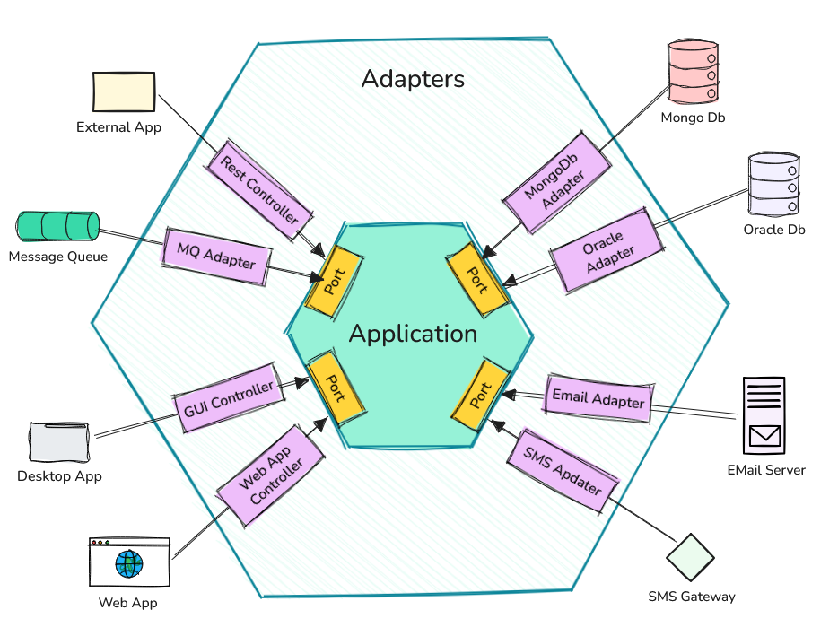
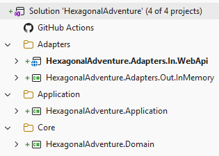

# Hexagonal Architecture 101

Hexagonal yazılım mimarisinin prensiplerini basit senaryolar üzerinden uygulamalı olarak öğrenmeye çalıştığım proje ve kodlarının yer aldığı repodur.

Bu mimari bazı kaynaklarda "Ports and Adapters" olarak da geçiyor. Orijini [Alistair Cockburn'ın şuradaki](https://alistair.cockburn.us/hexagonal-architecture) yazısına dayanıyor. Kaynaklara göre **2005** yılında beri hayatımızda olan bir tasarım. Tabii işin temelinde çok temel yazılım kavramları ve ilkeleri var. Her şey uygulama domain'i içerisindeki iş kurallarının dış dünyadan tamamen izole edilebilmesi fikrine dayanıyor. Bu zaten bir çok modern mimari yaklaşımın ana noktalarından birisi ancak uygulama biçimleri farklılık gösterebiliyor.

Sonuçta gevşek bağlılık *(Loose Coupling)*, sorumlulukların doğru ayrılması *(Separation of Concerns)*, bağımlılıkların tersine çevrilmesi *(Inversion of Control)*, bağımlılıkların dışarıdan sağlanması *(Dependency Injection)*, zengin nesneler *(rich entity - yazılım prensibi diyemesek de DDD'nin izlerinden birisi olarak mimaride yer bulabilir)* kullanılması gibi temel prensipler üzerine kurulu bir mimari. Bu prensipler sayesinde uygulama domain'i içerisindeki iş kuralları, dış dünyadan gelen veri kaynaklarından, kullanıcı arayüzünden, diğer sistemlerle entegrasyonlardan tamamen izole edilebilmektedir. Böylece uygulama domain'i içerisindeki kodun test edilebilirliği, sürdürülebilirliği ve esnekliği de artmakta.

Internette genellikle aşağıdakine benzer bir görsel ile bu mimari 50bin feet yüksekten anlatılmaya çalışır. *(Excalidraw.io üzerinde insan eliyle çizilmiştir :P)*

Grafiği şöyle özetlemeye çalışalım. İş kuralları ve domain yapısı tamamen Application katmanında yer alır. Bunu adaptörlerin oluşturduğu bir başka katman sarar. Adaptörler, uygulama domain'ini dış dünyaya bağlayan bir köprü görevi görürler. Dış dünya ise kullanıcı arayüzü, veri tabanı, diğer sistemlerle entegrasyonlar gibi unsurları içerir. Adaptörler, portlara bağlanarak uygulama domain'ine erişim sağlarlar. Portlar ise uygulama domain'inin dış dünyaya açılan kapılarıdır. Bu sayede uygulama domain'i tamamen izole edilmiş olur ve dış dünyadan gelen değişikliklerden etkilenmez. Böyle anlatınca ne güzel değil mi? Soyut soyut :D Pek tabii uygulamayı yazıp, avantaj ve dezavantajlarını görmeden mimariyi anlamamız pek mümkün değil.

**Mimarinin ana sloganı şudur:** Seperating Business Logic from Infrastructure with Ports and Adapters. Yani iş kurallarını altyapıdan portlar ve adaptörler ile ayırmak.

Burada kafa karıştıcı bazı meseleler olabiliyor. Örneğin adaptörlerin Inbound ve Outbound olarak ikiye ayrılması, portların ne olduğu, adaptörlerin portlara nasıl bağlandığı vb. Ben bu konuları mümkün olduğunca basit senaryolar üzerinden uygulamalı olarak incelemek istiyorum. Bu repodaki temel amacım bu...

## Senaryo

Kısır bir senaryo ile başlayalım. Stok takibi yapmak istediğimiz ürünler var. Buradaki basit iş kurallarını hexagonal mimarisine göre ele almaya çalışacağız. Uygulama kodlarını .Net platformunda C# ile yazacağım. Elbette bu mimariyi uygulamaya uygun farklı bir platform veya dilde seçilebilir. Sonuçta mimarinin prensipleri değişmeyecektir. Solution yapısını da aşağıdaki gibi oluşturabiliriz.

- **HexagonalAdventure.Domain** bir class library ve domain nesneleri ile iş kurallarını içeriyor.
- **HexagonalAdventure.Application** yine bir class library ve In/Out port nesnelerini içeriyor. Inbound Port'lar dış dünyanın çekirdeğe ulaşmak için kullanacağı sözleşmeler olarak düşünülebilir. Outbound Port nesneler ise çekirdeğin dış dünyadan yaptırmak istediği işler için kullanılan sözleşmedir.
- **HexagonalAdventure.Adapters** ise şu anda iki proje içeriyor. Bunlardan birisi Class Library ve Outbound Adapter olarak düşünülebilir. Örneğin EF tabanlı bir Repository implementasyonu burada yer alır. Outbound Port'ta tanımlanan sözleşmenin somut olarak uygulandığı yerdir. Diğer proje ise bir Web Api'dir ve Inbound Adapter olarak düşünülebilir. Dış dünyandan gelen isteği alır ve Inbound Port üstünden sistemi tetikler. Hatta web api projesindeki program sınıfı *Composition Root* görevini üstlenir. Yani uygulama başlarken port ve adaptörlerin eşleştirilip birbirine bağlandığı yerdir. Bu sayede uygulama domain içerisindeki kodun dış dünyaya olan bağımlılığı tamamen ortadan kalkar.

## Geliştirme Aşamaları
